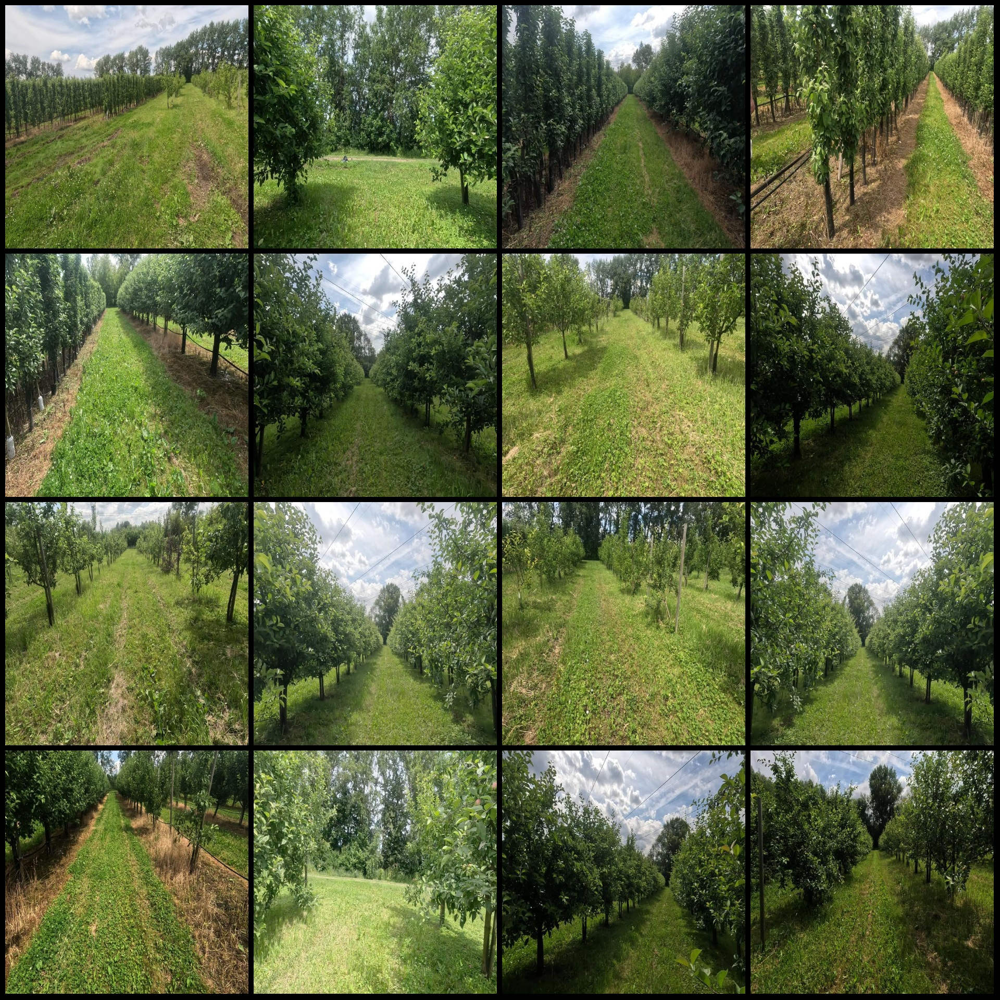
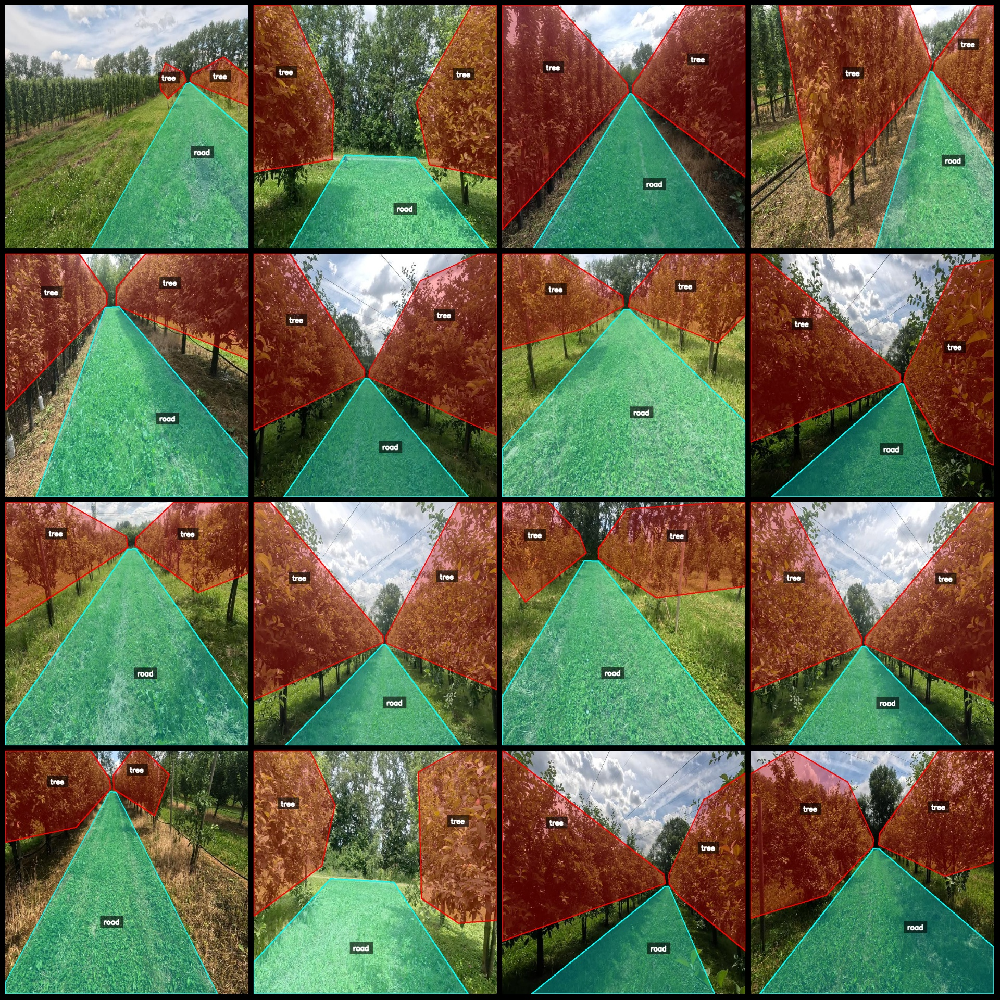
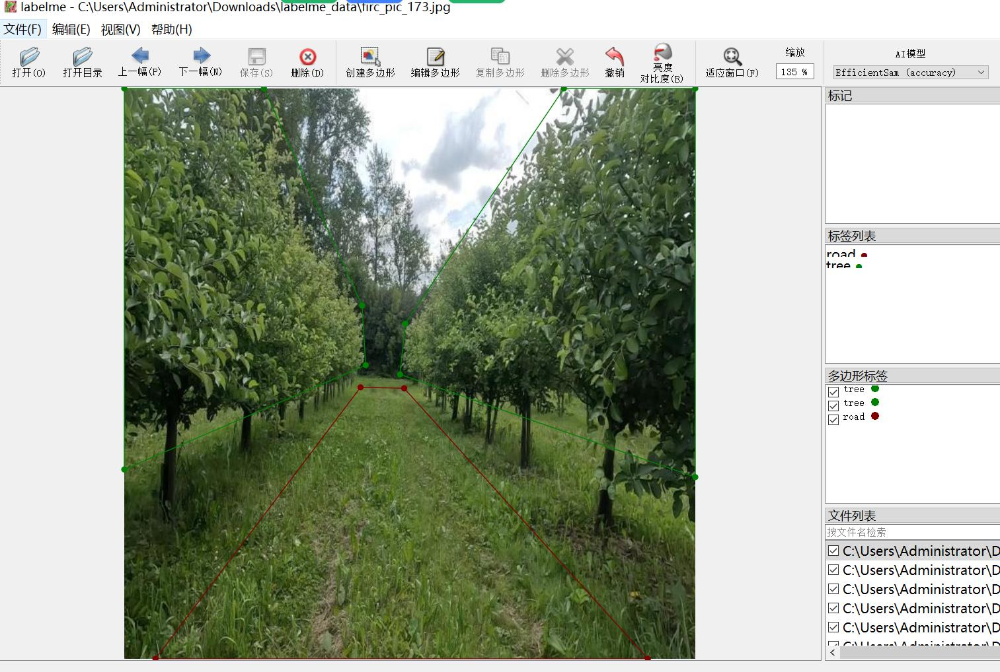

# Intelligent Agricultural Robot Field Lobby Identification Road Tree Area Isolation Dataset in LabelMe Format with 2560 Images and 2 Categories

Dataset format: labelme format (without mask files, only including jpg images and corresponding json files)
Number of image files (number of jpg files): 2560
Number of annotations (number of json files): 2560
Number of annotation categories: 2
Annotation category names: ["road", "tree"]
Total number of bounding boxes: 7609
Annotation tool used: labelme=5.5.0
Image resolution: 640x640
Annotation rules: Polygons are drawn around the categories
Important note: The dataset can be edited using labelme, while the json dataset needs to be converted into a mask, yolo, or coco format for semantic segmentation or instance segmentation.
Special declaration: This dataset does not guarantee the accuracy of the trained models or weight files.
Preview of images:
Annotation examples:
Randomly selected 16 images for annotation:
Annotation drawing results:
Labelme editing example image:

## Images

Here is a pay link on Stripe ( https://buy.stripe.com/3cs8yP7sY87d0vu9AB ). Please contact me lonlonago@foxmail.com after funding $89, and I will send you a complete data files , thank you!

